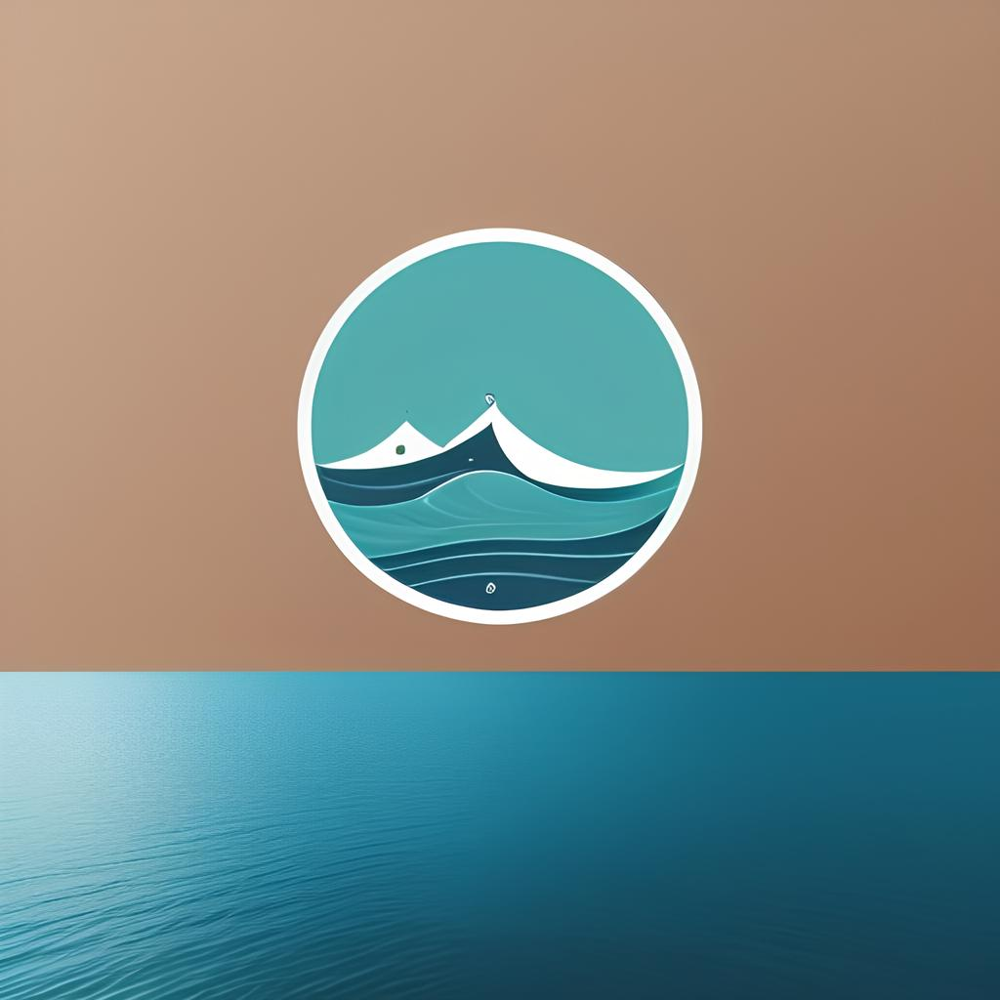
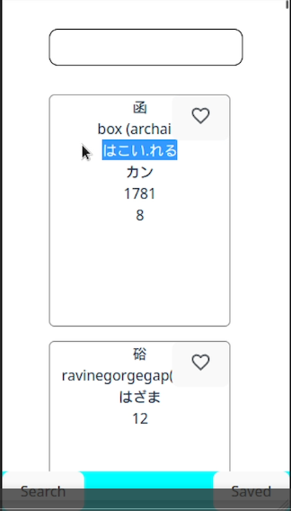
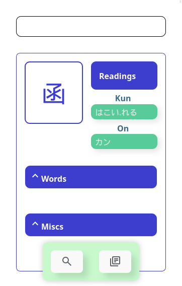
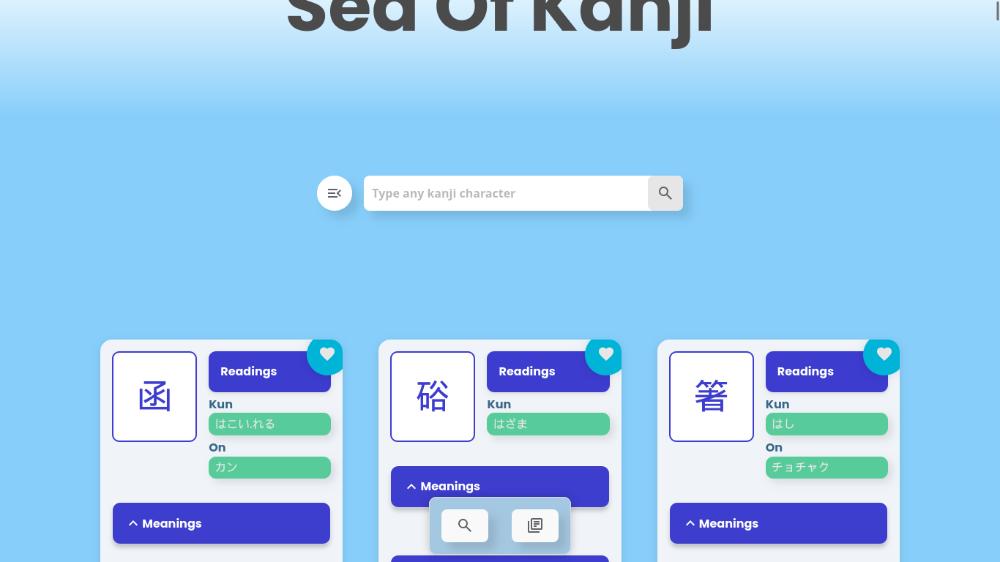
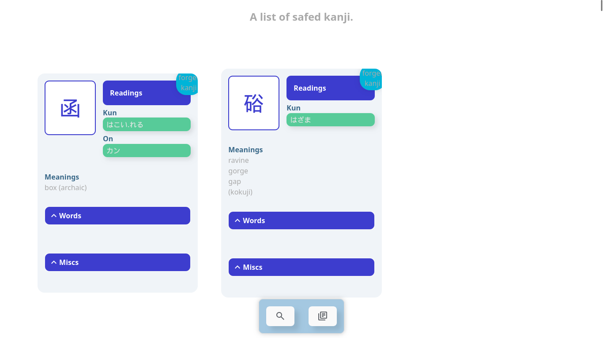
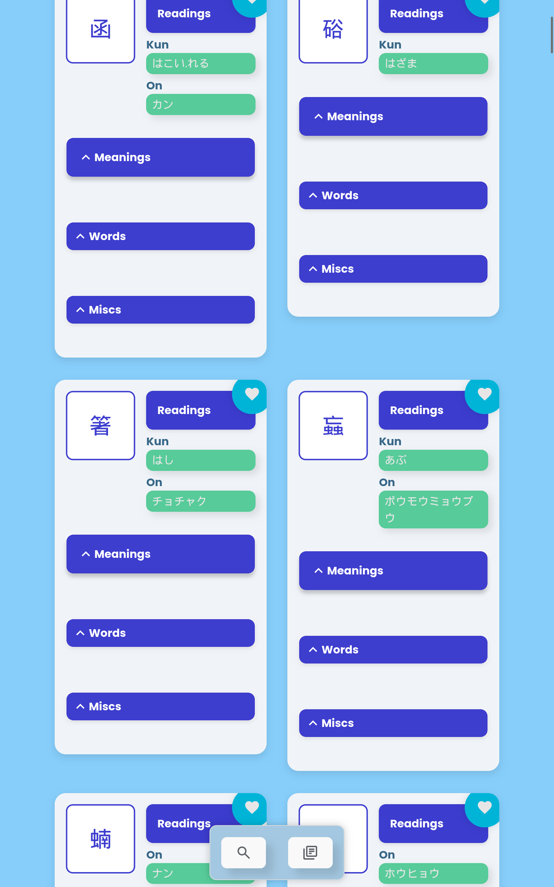
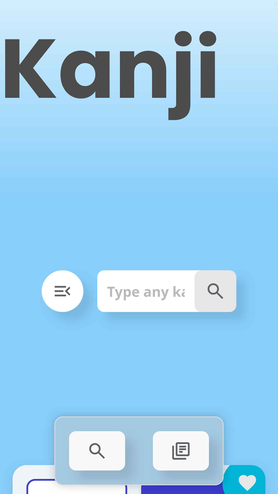

<!-- Improved compatibility of back to top link: See: https://github.com/othneildrew/Best-README-Template/pull/73 -->
<a id="readme-top"></a>
<!--
*** Thanks for checking out the Best-README-Template. If you have a suggestion
*** that would make this better, please fork the repo and create a pull request
*** or simply open an issue with the tag "enhancement".
*** Don't forget to give the project a star!
*** Thanks again! Now go create something AMAZING! :D
-->


<!-- PROJECT SHIELDS -->
<!--
*** I'm using markdown "reference style" links for readability.
*** Reference links are enclosed in brackets [ ] instead of parentheses ( ).
*** See the bottom of this document for the declaration of the reference variables
*** for contributors-url, forks-url, etc. This is an optional, concise syntax you may use.
*** https://www.markdownguide.org/basic-syntax/#reference-style-links
-->
<!-- [![Contributors][contributors-shield]][contributors-url]
[![Forks][forks-shield]][forks-url]
[![Stargazers][stars-shield]][stars-url]
[![Issues][issues-shield]][issues-url]
[![MIT License][license-shield]][license-url]
[![LinkedIn][linkedin-shield]][linkedin-url] -->


<!-- PROJECT LOGO -->
<br />
<div align="center">
  <a href="">
    
  </a>

<h3 align="center">Sea Of Kanji</h3>

  <p align="center">
    A platform which helps you to learn kanji faster!
    <br />
    <br />
    <a href="https://sea-of-kanji.vercel.app/">View Demo</a>
    ·
    <a href="https://github.com/BettoRaite/sea-of-kanji/issues">Report Bug</a>
    ·
    <a href="https://github.com/BettoRaite/sea-of-kanji/issues">Request Feature</a>
  </p>
</div>


<!-- TABLE OF CONTENTS -->
<details>
  <summary>Table of Contents</summary>
  <ol>
    <li>
      <a href="#about-the-project">About The Project</a>
      <ul>
        <li><a href="#built-with">Built With</a></li>
      </ul>
    </li>
    <li>
      <a href="#getting-started">Getting Started</a>
      <ul>
        <li><a href="#prerequisites">Prerequisites</a></li>
        <li><a href="#installation">Installation</a></li>
      </ul>
    </li>
    <li><a href="#progress">Progress</a></li>
    <li><a href="#roadmap">Roadmap</a></li>
    <li><a href="#contributing">Contributing</a></li>
    <li><a href="#license">License</a></li>
    <li><a href="#contact">Contact</a></li>
  </ol>
</details>


<!-- ABOUT THE PROJECT -->
## About The Project

<!-- [![Product Name Screen Shot][product-screenshot]](https://example.com) -->

"Sea of Kanji" is a passionate hobby project aimed at enriching your kanji learning journey. Its core concept is both straightforward and effective: effortlessly search for any specific kanji character you wish to learn and save it to your personalized kanji collection with just one tap. So, it's quick and easy, there's no need for registration or login, ensuring that all essential kanji information is readily accessible at any point of the day. When you're ready to refresh your memory, you can easily revisit your collection to review the kanji you've saved(Thanks to local storage), helping you reinforce your knowledge and recall any characters you may have forgotten.
<!-- 
Here's a blank template to get started: To avoid retyping too much info. Do a search and replace with your text editor for the following: `github_username`, `repo_name`, `twitter_handle`, `linkedin_username`, `email_client`, `email`, `project_title`, `project_description`
 -->

<p align="right">(<a href="#readme-top">back to top</a>)</p>


### Built With

* [![React][React.js]][React-url]

<p align="right">(<a href="#readme-top">back to top</a>)</p>


<!-- GETTING STARTED -->
## Getting Started
To get a local copy up and running follow these simple example steps.

### Prerequisites

First install pnpm if you don't have it.
* Install pnpm
  ```sh
  npm install pnpm@latest -g
  ```
* Install packages
  ```sh
  pnpm install 
  ```
### Installation

1. Get a free API Key at [https://rapidapi.com/BettoRaite/api/kanjibreakapi](https://rapidapi.com/BettoRaite/api/kanjibreakapi)
2. Clone the repo
   ```sh
   git clone https://github.com/github_username/repo_name.git
   ```
3. Install NPM packages
   ```sh
  pnpm install
   ```
4. Enter your API in `.env`
   ```js
   const VITE_RAPID_API_KEY = 'ENTER YOUR API';
   ```
5. Change git remote url to avoid accidental pushes to base project
   ```sh
   git remote set-url origin github_username/repo_name
   git remote -v # confirm the changes
   ```

<p align="right">(<a href="#readme-top">back to top</a>)</p>


<!-- USAGE EXAMPLES -->
## Usage

Use this space to show useful examples of how a project can be used. Additional screenshots, code examples and demos work well in this space. You may also link to more resources.

_For more examples, please refer to the [Documentation](https://example.com)_

<p align="right">(<a href="#readme-top">back to top</a>)</p>


## Progress
Some days have been lost because I did not record the progress.


#### Day 2
By day 2 I have alread done the basic setup, fetching data, showing it to the user and stuff like that.
Actually, I got a whole video of me building the project.
 

#### Day 3
Much better cards. Finally a not yet working search bar and of course, words! Tho to be honest, it was empty at that time.
 

#### Day 7
Search bar, words, website title, demo filter menu. (Beatiful isn't it?)
`Desktop`
 
`Tablet`
 
`Tablet scroll`
 
 `Search bar, mobile`
 
## Things learned so far

- Infinite scroll. (Not as hard as I imagined.)
```tsx
  useEffect(() => {
    // Handler function for scroll
    const handleScroll = () => {
      const { scrollTop, clientHeight, scrollHeight } =
        document.documentElement;
      if (scrollTop + clientHeight >= scrollHeight - 1000) {
        console.log(scrollTop, clientHeight, scrollHeight);
        /*
          Calls page handler function
          job of which is to increase
          page count, which is going to 
          be used in fetch url. (query param)
        */
        onNextPage();
      }
    };

    if (hasMorePages) {
      /*
        Avoiding unnessary handler attactment
      */
      window.addEventListener("scroll", handleScroll);
    }

    return () => {
      /*
        Once hasMorePages is false, the useEffect
        cleanUp fn will be run since it's specified
        as useEffect dependancy, once it's done. useEffect callback will rerun with new hasMorePages set to false.
      */
      if (hasMorePages) {
        window.removeEventListener("scroll", handleScroll);
      }
    };
  }, [hasMore, onNextPage]);
```
- Loading sceletons, the main idea of which is to show user some data placeholders while fetch process is outgoing. 
```tsx
 {isLoading && <CardsListSceleton />}
```

<!-- ROADMAP -->
## Roadmap

- [ ] Add more advanced search 
    - [ ] Search based on kanji meaning
    - [ ] Search based on kanji words
- [ ] Add filter menu component 
    - [ ] JLPT levels
    - [ ] Grade 
- [ ] Add new kanji collection component.
- [ ] Add wave-shaped border to website header.
- [ ] Add some form of quiz

<p align="right">(<a href="#readme-top">back to top</a>)</p>


<!-- CONTRIBUTING -->
## Contributing

Contributions are what make the open source community such an amazing place to learn, inspire, and create. Any contributions you make are **greatly appreciated**.

If you have a suggestion that would make this better, please fork the repo and create a pull request. You can also simply open an issue with the tag "enhancement".
Don't forget to give the project a star! Thanks again!

1. Fork the Project
2. Create your Feature Branch (`git checkout -b feature/AmazingFeature`)
3. Commit your Changes (`git commit -m 'Add some AmazingFeature'`)
4. Push to the Branch (`git push origin feature/AmazingFeature`)
5. Open a Pull Request

<p align="right">(<a href="#readme-top">back to top</a>)</p>

<!-- LICENSE -->
## License

Distributed under the MIT License. See `LICENSE.txt` for more information.

<p align="right">(<a href="#readme-top">back to top</a>)</p>


<!-- CONTACT -->
## Contact

Email - bettoraite@gmail.com

Project Link: [https://github.com/BettoRaite/sea-of-kanji](https://github.com/BettoRaite/sea-of-kanji)

<p align="right">(<a href="#readme-top">back to top</a>)</p>


<!-- ACKNOWLEDGMENTS
## Acknowledgments

* []()
* []()
* []()
 -->


<p align="right">(<a href="#readme-top">back to top</a>)</p>


<!-- MARKDOWN LINKS & IMAGES -->
<!-- https://www.markdownguide.org/basic-syntax/#reference-style-links -->
[contributors-shield]: https://img.shields.io/github/contributors/github_username/repo_name.svg?style=for-the-badge
[contributors-url]: https://github.com/github_username/repo_name/graphs/contributors
[forks-shield]: https://img.shields.io/github/forks/github_username/repo_name.svg?style=for-the-badge
[forks-url]: https://github.com/github_username/repo_name/network/members
[stars-shield]: https://img.shields.io/github/stars/github_username/repo_name.svg?style=for-the-badge
[stars-url]: https://github.com/github_username/repo_name/stargazers
[issues-shield]: https://img.shields.io/github/issues/github_username/repo_name.svg?style=for-the-badge
[issues-url]: https://github.com/github_username/repo_name/issues
[license-shield]: https://img.shields.io/github/license/github_username/repo_name.svg?style=for-the-badge
[license-url]: https://github.com/github_username/repo_name/blob/master/LICENSE.txt
[linkedin-shield]: https://img.shields.io/badge/-LinkedIn-black.svg?style=for-the-badge&logo=linkedin&colorB=555
[linkedin-url]: https://linkedin.com/in/linkedin_username
[product-screenshot]: images/screenshot.png
[Next.js]: https://img.shields.io/badge/next.js-000000?style=for-the-badge&logo=nextdotjs&logoColor=white
[Next-url]: https://nextjs.org/
[React.js]: https://img.shields.io/badge/React-20232A?style=for-the-badge&logo=react&logoColor=61DAFB
[React-url]: https://reactjs.org/
[Vue.js]: https://img.shields.io/badge/Vue.js-35495E?style=for-the-badge&logo=vuedotjs&logoColor=4FC08D
[Vue-url]: https://vuejs.org/
[Angular.io]: https://img.shields.io/badge/Angular-DD0031?style=for-the-badge&logo=angular&logoColor=white
[Angular-url]: https://angular.io/
[Svelte.dev]: https://img.shields.io/badge/Svelte-4A4A55?style=for-the-badge&logo=svelte&logoColor=FF3E00
[Svelte-url]: https://svelte.dev/
[Laravel.com]: https://img.shields.io/badge/Laravel-FF2D20?style=for-the-badge&logo=laravel&logoColor=white
[Laravel-url]: https://laravel.com
[Bootstrap.com]: https://img.shields.io/badge/Bootstrap-563D7C?style=for-the-badge&logo=bootstrap&logoColor=white
[Bootstrap-url]: https://getbootstrap.com
[JQuery.com]: https://img.shields.io/badge/jQuery-0769AD?style=for-the-badge&logo=jquery&logoColor=white
[JQuery-url]: https://jquery.com 